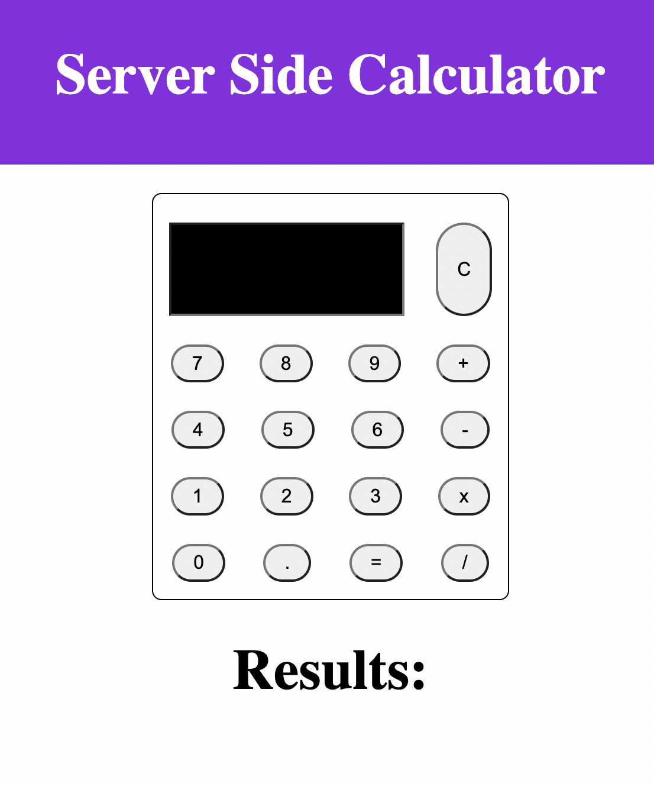
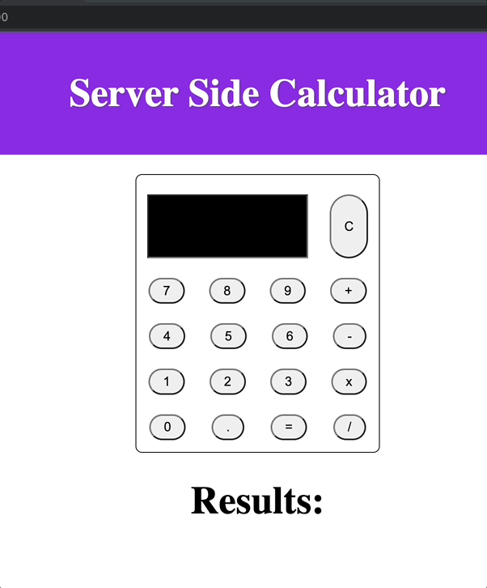

(View Raw will give you the markdown that you can copy to your repos!)

# Weekend jQuery Server Calculator

## Description

_Duration: 2 day Sprint_

This server-side calculator allows users to enter a math problem and returns a solution. The computation is done on the server-side and returned to the user to be displayed.  

One of the many challenges I faced while building this app was figuring out how to allow users to input numbers and a math operator in the text field only using the buttons. To access the value for each button, I assigned either a data-op or a data-number attribute to their corresponding button. Then their value are push into an array and added to the text input value attribute.

## Screen Shot

   

 

### Prerequisites

- [Node.js](https://nodejs.org/en/)
- [Express](https://expressjs.com/)
- [Body-Parser](https://www.npmjs.com/package/body-parser)

## Installation

## Built With

- HTML
- CSS
- JavaScript
- JQuery

## License
[MIT](https://choosealicense.com/licenses/mit/)

_Note, include this only if you have a license file. GitHub will generate one for you if you want!_

## Acknowledgement
Thanks to [Prime Digital Academy](www.primeacademy.io) who equipped and helped me to make this application a reality. (Thank your people)

## Support
If you have suggestions or issues, please email me at [youremail@whatever.com](www.google.com)
